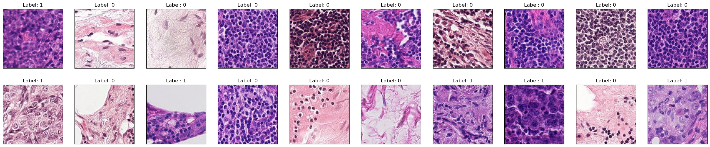
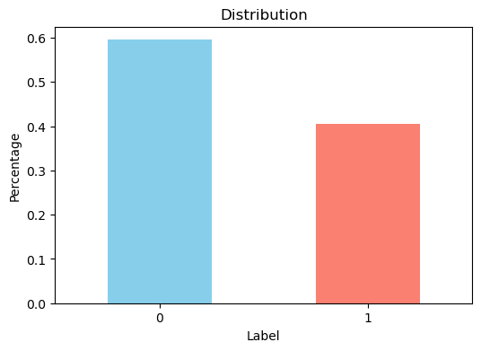
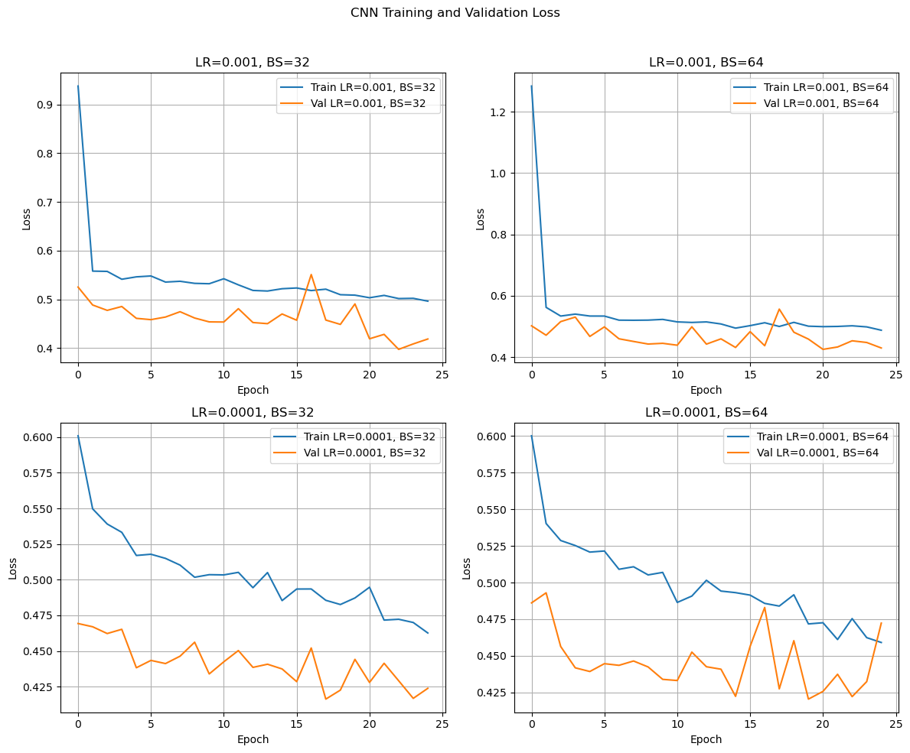
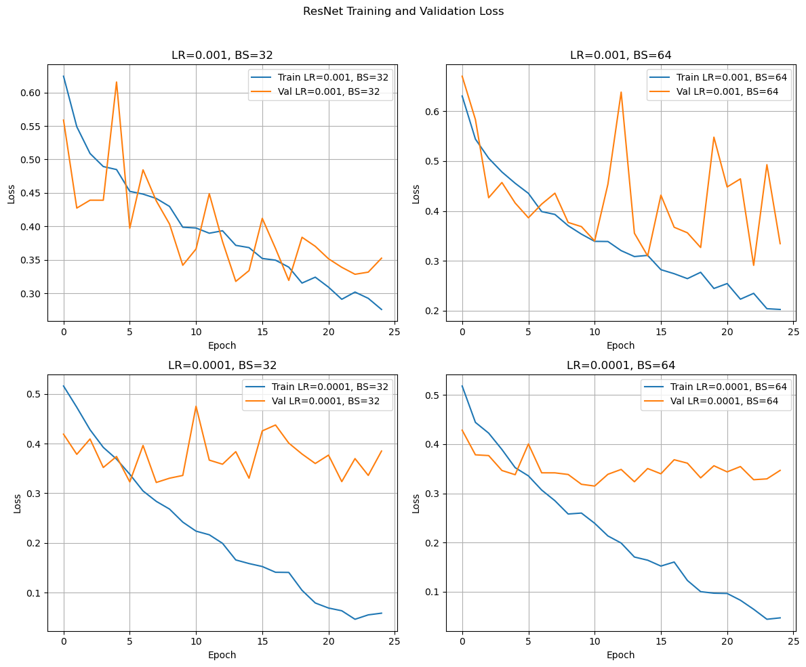
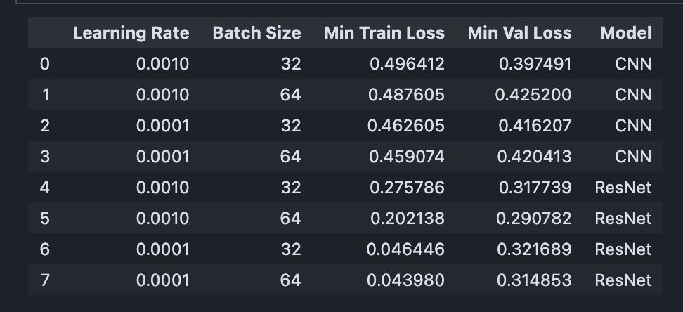
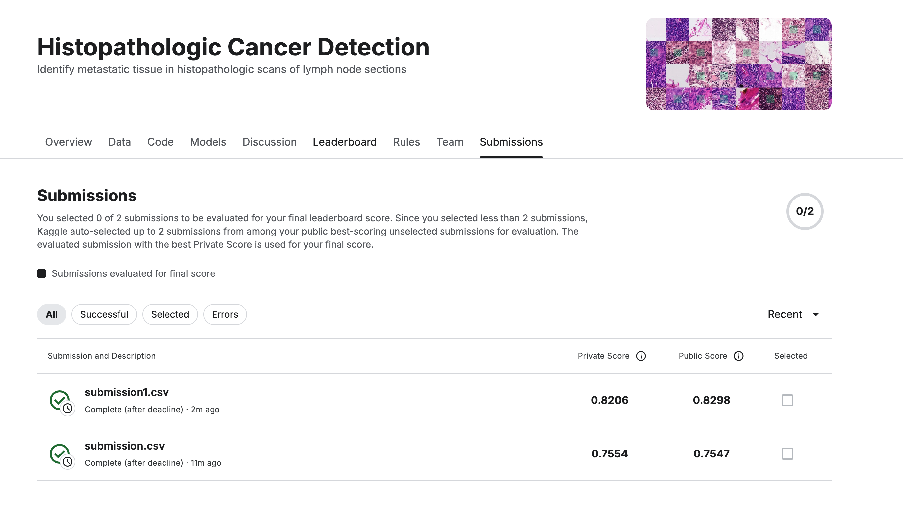

# cnn-cancer-detection

## 1. Description
Histopathologic Cancer Detection involves classifying images of tissue samples to determine whether they contain cancerous cells. This is typically framed as a binary classification problem, where: 

- Label 0 indicates non-cancerous tissue
- Label 1 indicates cancerous tissue

Based on the provided data:

1. Training Data: 220025
   - Training labels:
      - Non-cancerous (Label 0): 130908
      - Cancerous (Label 1): 89117
2. Test Data: 57458

## 2. EDA

## 3. Architecture
The notebook describes the architectures used (CNN and ResNet), including:
   - Justification for each architecture.
   - Comparison between architectures.
   - Hyperparameter tuning steps for each model.

## 4. Results and Analysis

## 5. Conclusion
### Learnings and Takeaways

From these experiments, I learned that:

1. **Learning Rate and Batch Size**: A learning rate of 0.001 and a batch size of 32 generally provide the best performance for both models. This combination allows for quick convergence and stable training.
2. **Model Stability**: The Custom ResNet model showed some instability in the validation loss, indicating potential overfitting. This suggests that further regularization techniques, such as dropout or data augmentation, could be beneficial.
3. **Training Time**: Smaller batch sizes resulted in better performance but may increase training time due to more frequent updates. 

### What Helped Improve Performance

1. **Optimal Hyperparameters**: Finding the optimal learning rate and batch size was crucial for improving model performance.
2. **Architecture Selection**: Using pre-trained models like ResNet provided a good starting point and helped achieve better results compared to a simple CNN.

### What Did Not Help

1. **Lower Learning Rates**: Very low learning rates (0.0001) slowed down the convergence and did not yield better results.
2. **Larger Batch Sizes**: Increasing the batch size to 64 did not significantly improve performance and sometimes led to higher losses.

### Future Improvements

1. **Regularization Techniques**: Implementing dropout, weight decay, and more aggressive data augmentation can help reduce overfitting and improve model stability.
2. **Learning Rate Scheduling**: Using learning rate schedulers like ReduceLROnPlateau or cyclic learning rates can help optimize the learning process.
3. **More Advanced Architectures**: Experimenting with more advanced architectures like EfficientNet, DenseNet, or hybrid models could yield better results.
4. **Hyperparameter Optimization**: Automated hyperparameter optimization techniques such as grid search, random search, or Bayesian optimization can help find the optimal hyperparameters more efficiently.

By applying these techniques, future models can achieve even better performance and generalization.

## 6. Submission
